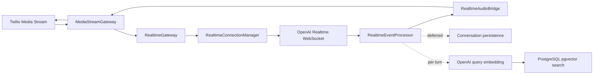

# Realtime Voice Latency Audit

Date: 2026-06-09

## Verdict

Overall: **PARTIAL**

The live audio path no longer performs database or Redis work per frame, buffers are
bounded, WebSocket barge-in truncates model context, RAG runs inside PostgreSQL, and
the API runs on Fastify. The 300-700 ms perceived-response objective is not declared
met because no controlled Twilio-to-OpenAI provider benchmark was available.

## Current Critical Path



Audio forwarding is synchronous and allocation-light. Persistence, audits, counters,
analytics, and memory refreshes are outside the frame-forwarding path.

## Findings

1. **Critical: per-frame database writes**
   - Previous packet and audio counters updated Prisma for every frame.
   - Fixed with in-memory per-session counters and disconnect/shutdown flushing.
   - See `call-session.service.ts:47` and `realtime-session.service.ts`.

2. **Critical: in-process vector scan**
   - Previous retrieval loaded tenant embeddings and calculated cosine similarity in Node.
   - Fixed with tenant-filtered PostgreSQL vector search, a native vector column, and HNSW.
   - See `rag.repository.ts:28` and migration lines 1-45.

3. **High: incomplete WebSocket barge-in**
   - Previous interruption only cleared Twilio playback.
   - Fixed by immediately sending Twilio `clear`, OpenAI `response.cancel`, and
     `conversation.item.truncate` using played PCMU duration.
   - See `realtime-event-processor.ts:250`.

4. **High: webhook-blocking secondary writes**
   - Previous TwiML response waited for audits and a secondary call-status update.
   - Fixed by retaining routing lookup and idempotent call creation as critical work while
     deferring audits and secondary status persistence.
   - See `incoming-call.service.ts:20`.

5. **High: Express adapter and global compression**
   - Migrated to Nest Fastify with keep-alive and socket timeouts.
   - Compression is restricted to suitable HTTP content types; audio and WebSockets are
     not compressed.
   - See `main.ts:15`.

6. **High: unbounded startup and socket buffers**
   - Added packet and byte bounds for Twilio-to-OpenAI, OpenAI-to-Twilio, startup audio,
     and raw WebSocket frames. Stale audio is dropped and counted under backpressure.
   - See `realtime-connection-manager.ts:105`, `realtime.gateway.ts:134`, and
     `media-stream.gateway.ts`.

7. **Medium: repeated RAG context accumulation**
   - Retrieved knowledge is now bounded and supplied per `response.create`, rather than
     appended permanently as system items in the Realtime conversation.
   - See `realtime-event-processor.ts:180`.

8. **Medium: broad hot-path relation loading**
   - Realtime context lookup now selects only routing and agent fields needed for a call.
   - See `realtime-session.repository.ts`.

9. **Medium: insufficient percentile instrumentation**
   - Added monotonic p50/p95/p99 distributions, success/failure counts, event-loop lag,
     cache ratio, active calls, drops, backpressure, and OpenAI disconnect counters.
   - See `realtime-metrics.service.ts:27`.

## Latency Budget

| Stage | Relationship | Target |
| --- | --- | ---: |
| Twilio webhook routing | Sequential before TwiML | 20 ms p95 |
| Phone route lookup | Inside webhook; cacheable | 10 ms p95 |
| Call record creation | Sequential and routing-critical | 10 ms p95 |
| OpenAI connection | Parallel with memory load | Report separately |
| End-of-speech detection | Provider/VAD controlled | Report separately |
| Query embedding | Sequential only when RAG is enabled | Measured separately |
| Vector search | Sequential after query embedding | 50 ms p95 |
| OpenAI response start | After turn context is ready | 300 ms p95 |
| First audio write to Twilio | Direct forwarding | 20 ms p95 |
| Audits/transcripts/counters/memory | Concurrent/deferred | 0 ms on audio path |

Speech-to-speech audio generation is measured from actual Realtime events; it is not
modeled as a sequential text-generation and TTS pipeline.

## Database Changes

Migration `20260609050000_realtime_latency_architecture`:

- Installs pgvector.
- Adds and synchronizes `vector(1536)` storage.
- Adds an HNSW cosine index.
- Adds tenant/knowledge-base and call/session composite indexes.
- Preserves the existing float-array field during migration and provider transition.

The query uses a small nearest-candidate CTE, then applies deterministic source ordering
and tenant/source validation. `hnsw.iterative_scan=strict_order` is set on database pool
connections.

## Measured Evidence

Measurements are local and do not include Twilio or OpenAI network time.

### Fastify HTTP

Command:

```bash
HTTP_AUTO_LOGGING=false NODE_ENV=production API_PORT=4100 \
  pnpm --filter @ai-agent-platform/api start
ab -n 2000 -c 50 http://127.0.0.1:4100/api/v1/health/live
```

| Configuration | p50 | p95 | p99 | Failures |
| --- | ---: | ---: | ---: | ---: |
| Access logging to attached terminal | 43 ms | 189 ms | 686 ms | 0 |
| Access logging disabled for isolation | 38 ms | 98 ms | 224 ms | 0 |

Sequential warm samples were mostly 1.6-4.5 ms. Concurrent tails varied substantially
on this development laptop, so these numbers are not production capacity evidence.

### PostgreSQL

- Indexed E.164 phone lookup: 0.402 ms execution, two shared buffer hits.
- Temporary 10,000-vector tenant-filtered search:
  - cold execution: 28.080 ms
  - warm execution: 19.650 ms
- The synthetic planner selected the tenant composite B-tree plus database-side distance
  sort for the 25%-selective test data. The application HNSW index remains available for
  larger/less-selective datasets.

Run:

```bash
psql "$DATABASE_URL" -f apps/api/scripts/benchmark-pgvector.sql
BENCHMARK_URL=http://127.0.0.1:4000/api/v1/health/live \
BENCHMARK_REQUESTS=2000 BENCHMARK_CONCURRENCY=50 \
pnpm --filter @ai-agent-platform/api benchmark:latency
```

No valid end-to-end pre-change provider baseline existed. The before/after HTTP result
above isolates request-log backpressure; other improvements are supported by code-path,
test, query-plan, and operation-count evidence rather than fabricated baseline latency.

## Validation

- `pnpm typecheck`: pass
- `pnpm lint`: pass
- API Jest: 43 suites, 159 tests, pass
- API build: pass
- Prisma validate and generate: pass
- Migration applied locally: pass
- Focused coverage includes interruption/truncation, repeated failure cleanup,
  20 concurrent isolated calls, bounded backpressure, tenant routing, and counter flush.

## Latency Gates

| Gate | Verdict | Evidence |
| --- | --- | --- |
| Webhook p95 < 20 ms warm | PARTIAL | Instrumented and secondary writes removed; no signed Twilio percentile run |
| Database hot lookup p95 < 10 ms | PARTIAL | 0.402 ms local execution; no representative percentile set |
| Redis lookup p95 < 5 ms | PASS for audio path | Redis is not used for live audio forwarding |
| RAG vector search p95 < 50 ms | PARTIAL | 28.080 ms cold and 19.650 ms warm synthetic samples; not a p95 production corpus |
| OpenAI response start p95 < 300 ms | NOT VERIFIED | Requires live OpenAI Realtime traffic |
| First audio forwarding p95 < 20 ms | PARTIAL | Direct synchronous path and instrumentation; no provider load percentile |
| Total perceived response p95 < 700 ms | NOT VERIFIED | Requires concurrent Twilio/OpenAI calls |

## Remaining Limitations

- Real provider latency, packet loss, regional routing, and OpenAI rate limits were not
  reproducible locally.
- VAD defaults are configurable but require production speech/false-turn tuning.
- A production corpus should validate HNSW recall, selectivity, and p95 using the exact
  organization/knowledge-base distribution.
- Metrics are process-local. Production should export them to the platform's metrics
  backend without adding network work to the live frame path.
- Tool-call execution is not currently part of the Realtime voice path; timeout,
  cancellation, and idempotency must be enforced when tools are added.
