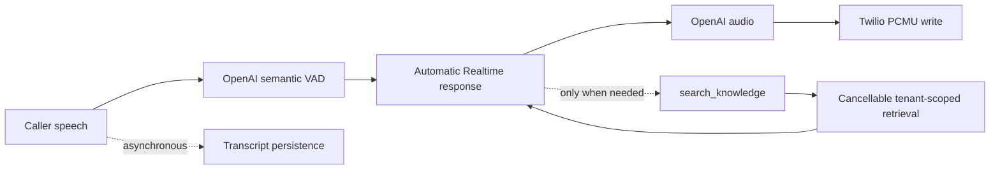

# Realtime Voice Turn-Taking Upgrade

Date: 2026-06-18

## Before


Normal turns were configured with `create_response: false`; transcript completion,
embedding, and vector search were mandatory before generation.

## After



Normal speech-to-speech turns no longer wait for transcription or RAG. A compact,
bounded startup knowledge summary is included in the session instructions. Deeper
knowledge is fetched through a registered Realtime function tool.

## Key Changes

- Realtime VAD creates normal responses automatically with interruption enabled.
- Transcription is asynchronous persistence/debug data only.
- `search_knowledge` derives tenant, agent, and knowledge-base scope from the active
  call context; model arguments cannot select a tenant.
- Embedding requests receive an `AbortSignal`; PostgreSQL vector searches use a local
  statement timeout.
- Exact FAQ and semantic query results use bounded tenant-safe caches.
- Startup knowledge cache invalidation includes agent and knowledge update timestamps.
- Startup context, OpenAI connection, persistence setup, tools, memory, and knowledge
  loading are parallelized where safe.
- Twilio PCMU audio is forwarded to OpenAI before packet accounting and recording
  capture.
- Recording buffers remain bounded and report dropped bytes.
- Realtime metrics use monotonic timestamps, p50/p95/p99 summaries, cold/warm
  distributions, asynchronous process-restart persistence, and Prometheus text output.
- Barge-in clears Twilio immediately, cancels OpenAI, truncates unplayed audio, ignores
  stale cancellations, and serializes tool continuations.

## Validation

```bash
pnpm --filter @ai-agent-platform/api lint
pnpm --filter @ai-agent-platform/api typecheck
pnpm --filter @ai-agent-platform/api build
NODE_ENV=test pnpm --filter @ai-agent-platform/api exec jest --runInBand
pnpm --filter @ai-agent-platform/api benchmark:recording
```

## Synthetic Hot-Path Benchmark

Scope: in-process Twilio-to-OpenAI forwarding plus recording capture. It excludes
Twilio, OpenAI, network, database, Redis, disk, and S3 latency. Each level used 500
20-ms PCMU packets per simulated call.

| Streams | Before p50 µs | After p50 µs | Before p95 µs | After p95 µs | Before p99 µs | After p99 µs |
| ------: | ------------: | -----------: | ------------: | -----------: | ------------: | -----------: |
|       1 |         2.084 |        1.459 |         8.833 |        4.750 |        51.916 |       18.208 |
|       5 |         1.458 |        0.708 |         1.625 |        1.625 |         9.208 |        8.750 |
|      20 |         0.625 |        0.625 |         1.250 |        1.125 |         4.917 |        5.125 |
|      50 |         0.583 |        0.541 |         0.959 |        0.959 |         3.375 |        3.833 |

After-change OpenAI-audio-to-Twilio-write p95 was 0.541, 0.417, 0.250, and
0.125 microseconds at 1, 5, 20, and 50 streams respectively. No recording bytes or
frames were dropped. Retained heap after close was under 0.7 MB at 50 streams.

These synthetic results support hot-path and memory-safety conclusions only. They do
not prove provider latency.

## Latency Goal Verdicts

| Goal                                      | Verdict           | Evidence                                                          |
| ----------------------------------------- | ----------------- | ----------------------------------------------------------------- |
| OpenAI warm connection p95 < 300 ms       | PARTIAL           | Instrumented cold/warm; requires enough live OpenAI samples       |
| Endpoint to response-created p95 < 300 ms | PARTIAL           | Mandatory transcript/RAG gate removed; live percentile pending    |
| First OpenAI audio to Twilio p95 < 20 ms  | PASS (in-process) | 50-stream synthetic p95 0.125 µs; provider/network excluded       |
| Total perceived response p95 < 700 ms     | PARTIAL           | Correctly instrumented; live non-tool sample count pending        |
| Knowledge turns reported separately       | PASS              | RAG embedding/vector/total/timeout/cancellation/cache metrics     |
| No unbounded memory growth                | PASS (synthetic)  | Bounded queues; 50-stream retained heap under 0.7 MB              |
| No shared state across calls              | PASS              | Per-stream connection/playback/response state and isolation tests |

## External Limitations

- OpenAI Realtime connection and generation variance cannot be established by a local
  benchmark.
- Twilio carrier routing, caller acoustics, packet loss, and PSTN jitter require
  production-call sampling.
- Semantic VAD tuning must be revisited after a representative corpus of US/Canadian
  accents, background noise, interruptions, and short/filler turns is collected.
- PASS must not be assigned to provider-dependent p95 goals until the persisted metrics
  contain enough representative cold and warm samples.
